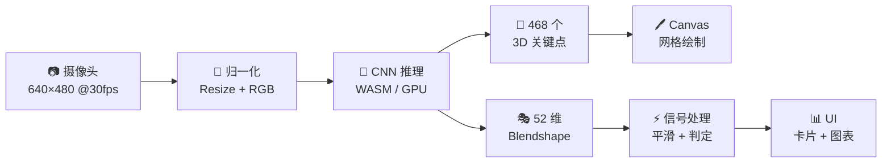
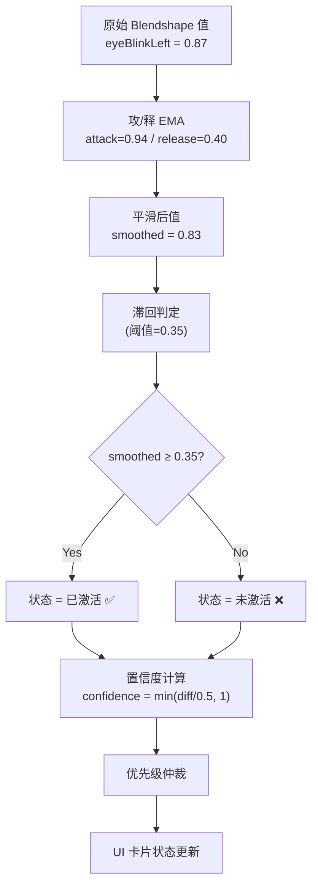
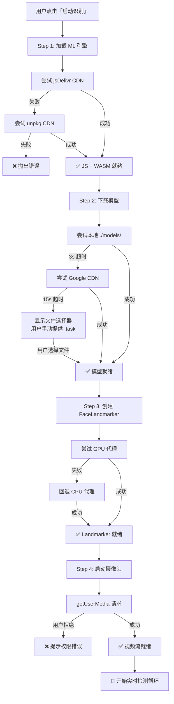
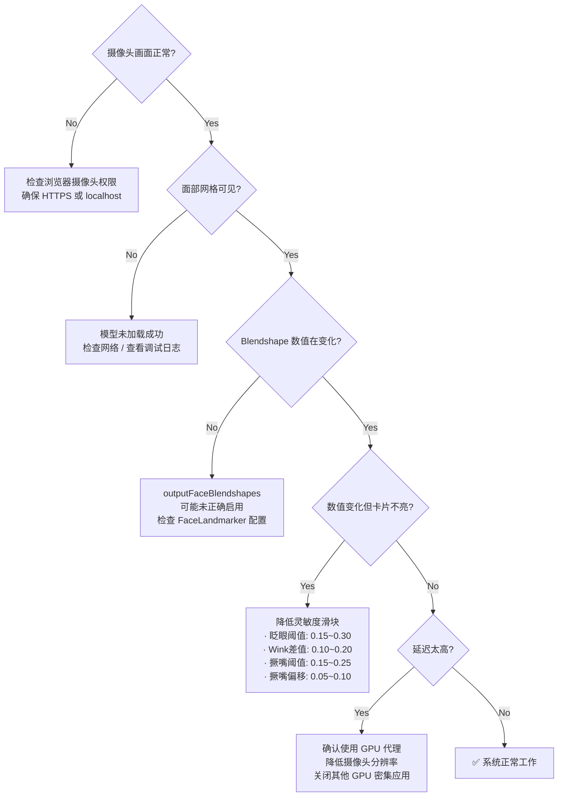

# 面部动作识别技术方案

> 基于 MediaPipe FaceLandmarker · 纯前端实时识别 · 无需后端服务

---

## 目录

- [1. 系统架构](#1-系统架构)
- [2. 技术栈](#2-技术栈)
- [3. 核心原理](#3-核心原理)
- [4. 468 个面部关键点](#4-468-个面部关键点)
- [5. 52 维 Blendshape 表情系数](#5-52-维-blendshape-表情系数)
- [6. 不对称动作识别算法](#6-不对称动作识别算法)
- [7. 信号处理流水线](#7-信号处理流水线)
- [8. 优先级判定机制](#8-优先级判定机制)
- [9. 资源加载与容错](#9-资源加载与容错)
- [10. 性能指标](#10-性能指标)
- [11. 常见问题排查](#11-常见问题排查)
- [附录 A：Blendshape 完整列表](#附录-a-blendshape-完整-52-维列表)
- [附录 B：关键参数速查](#附录-b-关键参数速查)

---

## 1. 系统架构

```
┌─────────────────────────────────────────────────────────────┐
│                        浏览器 (Client)                       │
│                                                             │
│  ┌──────────┐    ┌───────────────────┐    ┌──────────────┐  │
│  │  摄像头   │───▶│  Video → Frame    │───▶│  FaceLand-   │  │
│  │ getUserMedia│  │  captureToFrame() │    │  marker      │  │
│  └──────────┘    └───────────────────┘    │  (WASM/GPU)  │  │
│                                           └──────┬───────┘  │
│                                                  │          │
│                          ┌───────────────────────┼──────┐   │
│                          │                       ▼      │   │
│                          │  ┌─────────────────────────┐ │   │
│                          │  │    输出结果              │ │   │
│                          │  │  · 468 个 3D 关键点      │ │   │
│                          │  │  · 52 维 Blendshape 系数 │ │   │
│                          │  └─────────┬───────────────┘ │   │
│                          │            │                 │   │
│                          │            ▼                 │   │
│                          │  ┌─────────────────────────┐ │   │
│                          │  │   信号处理流水线         │ │   │
│                          │  │  ① 攻/释 EMA 平滑      │ │   │
│                          │  │  ② 滞回阈值判定         │ │   │
│                          │  │  ③ 不对称组合逻辑       │ │   │
│                          │  │  ④ 优先级仲裁           │ │   │
│                          │  └─────────┬───────────────┘ │   │
│                          │            │                 │   │
│                          │            ▼                 │   │
│                          │  ┌─────────────────────────┐ │   │
│                          │  │   UI 渲染               │ │   │
│                          │  │  · 面部网格叠加绘制     │ │   │
│                          │  │  · 动作指示卡片高亮     │ │   │
│                          │  │  · Blendshape 条形图    │ │   │
│                          │  │  · 调试原始值面板       │ │   │
│                          │  └─────────────────────────┘ │   │
│                          └──────────────────────────────┘   │
└─────────────────────────────────────────────────────────────┘
```

所有计算均在浏览器端完成，无需后端服务器，视频帧不会离开用户设备。

---

## 2. 技术栈

| 层级 | 技术 | 作用 |
|:-----|:-----|:-----|
| **运行时** | WebAssembly (WASM) | 模型推理引擎，接近原生性能 |
| **加速** | WebGL / WebGPU | GPU 加速矩阵运算 |
| **ML 框架** | `@mediapipe/tasks-vision` | Google 官方 Vision AI 工具包 |
| **模型** | FaceLandmarker (float16) | 面部关键点 + Blendshape 模型 |
| **摄像头** | WebRTC `getUserMedia` | 实时视频流采集 |
| **渲染** | Canvas 2D | 面部网格叠加层绘制 |
| **模块加载** | ES Module (`import`) | 按需加载 MediaPipe JS |

### 资源清单

```
资源                              大小       来源                    加载方式
────────────────────────────────────────────────────────────────────────────
vision_wasm_internal.wasm        ~2 MB     jsDelivr / unpkg        运行时加载
face_landmarker.task (float16)   ~3 MB     本地 → Google CDN       启动时下载
JS Module (tasks-vision)         ~200 KB   jsDelivr / unpkg        ES import
────────────────────────────────────────────────────────────────────────────
合计首次加载                                  ~5 MB（之后浏览器缓存）
```

---

## 3. 核心原理



### 处理流程详解

| 阶段 | 描述 | 耗时 (参考) |
|:-----|:-----|:------------|
| **采集** | 从 `<video>` 获取当前帧 | < 1 ms |
| **预处理** | 缩放至模型输入尺寸，色彩空间转换 | ~2 ms |
| **推理** | CNN 前向传播，输出关键点 + Blendshape | GPU: ~8 ms / CPU: ~30 ms |
| **后处理** | 坐标解码、Blendshape 分数归一化 | ~1 ms |
| **信号处理** | EMA 平滑 + 滞回 + 组合判定 | < 1 ms |
| **渲染** | Canvas 绘制 + DOM 更新 | ~2 ms |
| **合计** | | **GPU: ~15 ms (67fps)** / **CPU: ~37ms (27fps)** |

---

## 4. 468 个面部关键点

FaceLandmarker 输出 **468 个三维坐标点**（`refineLandmarks` 模式下额外输出 10 个虹膜点，共 478 个），每个点包含：

```json
{
  "x": 0.5123,
  "y": 0.3847,
  "z": -0.0421
}
```

- `x`：归一化宽度 (0~1)
- `y`：归一化高度 (0~1)
- `z`：深度（相对于面部中心）

### 关键点区域分布

```
                    ┌─── #10 额头中心
                    │
        #234 ───┐  │  ┌─── #454
        #172 ─┐ │  │  │ ┌─ #323
              │ │  │  │ │
   #127 ─┐   │┌┘  ▼  └┐│   ┌─ #361
         │   ││  #10    ││   │
    #21 ─┤   ├┼─────────┼┤   ├─ #288
         │   ││         ││   │
  #54 ─┐ │   ││ #33 ┌──┐││   │ ┌─ #397
       │ │   ││     │👁│││   │ │
 #103 ─┤ │   ││ #263│  │││   │ ├─ #365
       │ │   ││     └──┘││   │ │
  #67 ─┤ │   │├─────────┤│   │ ├─ #379
       │ │   ││         ││   │ │
 #109 ─┘ │   ││  #61  ┌─┤│   │ └─ #378
         │   ││  嘴角→ │💋││  │
         │   ││  #291 └─┤│   │
         │   ││  #13 上唇│   │
         │   ││  #14 下唇│   │
         │   ││         ││   │
         └───┘└────┬────┘└───┘
                   │
              #152 下巴
```

### 本系统使用的绘连线组

| 区域 | 关键点索引对数 | 线条颜色 | 线宽 |
|:-----|:--------------|:---------|:-----|
| 面部轮廓 | 36 对 | 紫色 `rgba(180,122,255,0.3)` | 1.2px |
| 左眼 | 16 对 | 青色 `rgba(0,212,255,0.45)` | 1.2px |
| 右眼 | 16 对 | 青色 `rgba(0,212,255,0.45)` | 1.2px |
| 左眉 | 9 对 | 青色 `rgba(0,212,255,0.25)` | 1px |
| 右眉 | 9 对 | 青色 `rgba(0,212,255,0.25)` | 1px |
| 外唇 | 20 对 | 粉色 `rgba(255,61,143,0.5)` | 1.4px |
| 内唇 | 20 对 | 粉色 `rgba(255,61,143,0.3)` | 1px |

---

## 5. 52 维 Blendshape 表情系数

Blendshape 是模型对**面部肌肉运动**的量化表达。每个系数取值 `0.0 ~ 1.0`，代表该表情的激活程度。

### 本系统监控的 24 个关键 Blendshape

#### 👁 眼部 (6 个)

| Blendshape 名称 | 含义 | 取值范围 | 用于识别 |
|:----------------|:-----|:---------|:---------|
| `eyeBlinkLeft` | 左眼眨眼 | 0~1 | 左眼 Wink / 双眼眨眼 |
| `eyeBlinkRight` | 右眼眨眼 | 0~1 | 右眼 Wink / 双眼眨眼 |
| `eyeWideLeft` | 左眼瞪大 | 0~1 | 瞪大眼 |
| `eyeWideRight` | 右眼瞪大 | 0~1 | 瞪大眼 |
| `eyeSquintLeft` | 左眼眯眼 | 0~1 | 眯眼 |
| `eyeSquintRight` | 右眼眯眼 | 0~1 | 眯眼 |

#### 👄 嘴部 (12 个)

| Blendshape 名称 | 含义 | 取值范围 | 用于识别 |
|:----------------|:-----|:---------|:---------|
| `mouthPucker` | 嘟嘴/撅嘴 | 0~1 | 左/右撅嘴 |
| `mouthFunnel` | 嘴巴漏斗形 | 0~1 | 辅助撅嘴判定 |
| `mouthLeft` | 嘴角向左移 | 0~1 | 左撅嘴偏移 |
| `mouthRight` | 嘴角向右移 | 0~1 | 右撅嘴偏移 |
| `mouthSmileLeft` | 左侧微笑 | 0~1 | 微笑 |
| `mouthSmileRight` | 右侧微笑 | 0~1 | 微笑 |
| `mouthFrownLeft` | 左侧撇嘴 | 0~1 | 左撇嘴 |
| `mouthFrownRight` | 右侧撇嘴 | 0~1 | 右撇嘴 |
| `mouthOpen` | 嘴巴张开 | 0~1 | 张嘴 |
| `mouthDimpleLeft` | 左酒窝 | 0~1 | — |
| `mouthDimpleRight` | 右酒窝 | 0~1 | — |
| `mouthStretchLeft` | 左嘴角拉伸 | 0~1 | — |

#### 其他 (6 个)

| Blendshape 名称 | 含义 | 用于识别 |
|:----------------|:-----|:---------|
| `browInnerUp` | 眉心上扬 | 挑眉 |
| `browDownLeft` | 左眉下压 | 左皱眉 |
| `browDownRight` | 右眉下压 | 右皱眉 |
| `jawOpen` | 下巴张开 | 张嘴 |
| `cheekPuff` | 鼓腮 | 鼓腮 |
| `tongueOut` | 吐舌 | 吐舌 |

### Blendshape 数值可视化示例

```
正常状态:                          眨眼状态:
                                   eyeBlinkLeft: 0.92
eyeBlinkLeft:  ████░░░░░░  0.05   eyeBlinkLeft:  ████████░░  0.92
eyeBlinkRight: ███░░░░░░░  0.04   eyeBlinkRight: █████████░  0.88
mouthPucker:   ██░░░░░░░░  0.03   mouthPucker:   ██░░░░░░░░  0.03
mouthLeft:     █░░░░░░░░░  0.02   mouthLeft:     █░░░░░░░░░  0.02

左眼 Wink 状态:                    左撅嘴状态:
eyeBlinkLeft:  ████████░░  0.85   mouthPucker:   ███████░░░  0.72
eyeBlinkRight: █░░░░░░░░░  0.06   mouthLeft:     █████░░░░░  0.55
mouthPucker:   ██░░░░░░░░  0.03   mouthRight:    █░░░░░░░░░  0.08
mouthLeft:     █░░░░░░░░░  0.02   eyeBlinkLeft:  █░░░░░░░░░  0.04
```

---

## 6. 不对称动作识别算法

### 6.1 Wink 识别（非对称眨眼）

```
核心思想: 左右眼闭合程度的"均值"和"差值"联合判定

                 均值 avg = (eBL + eBR) / 2
                 差值 diff = |eBL - eBR|

                        ┌───────────────────┐
                        │   读取 eBL, eBR   │
                        └────────┬──────────┘
                                 │
                        ┌────────▼──────────┐
                        │  avg < 阈值?       │
                        │  (两只眼都睁着?)    │── Yes ──▶ 【无动作】
                        └────────┬──────────┘
                                 │ No
                        ┌────────▼──────────┐
                        │  diff < diff阈值?  │
                        │  (两只眼一样程度?)  │── Yes ──▶ 【双眼眨眼】
                        └────────┬──────────┘
                                 │ No (一大一小)
                        ┌────────▼──────────┐
                        │  eBL > eBR ?       │
                        ├────────┬──────────┤
                        │        │          │
                    Yes ▼        │          ▼ No
              ┌────────────┐     │   ┌─────────────┐
              │ 【左眼 Wink】│    │   │ 【右眼 Wink】 │
              └────────────┘     │   └─────────────┘
                                 │
```

#### 判定真值表

| eyeBlinkLeft | eyeBlinkRight | 均值 | 差值 | 判定结果 |
|:------------:|:-------------:|:----:|:----:|:---------|
| 0.05 | 0.04 | 0.05 | 0.01 | — (无动作) |
| 0.82 | 0.78 | 0.80 | 0.04 | 双眼眨眼 |
| 0.85 | 0.06 | 0.46 | 0.79 | **左眼 Wink** |
| 0.03 | 0.88 | 0.46 | 0.85 | **右眼 Wink** |

### 6.2 不对称撅嘴识别

```
核心思想: 先判定是否在嘟嘴，再看嘴角偏移方向

                  mouthPucker: 0.72
                  mouthFunnel: 0.45
                       │
                       ▼
              puck = max(pucker, funnel × 0.7)
                       │
                       ▼
                  ┌─────────────┐
                  │ puck < 阈值? │── Yes ──▶ 【未嘟嘴】
                  └──────┬──────┘
                         │ No
                         ▼
                  biasL = mouthLeft - mouthRight
                  biasR = mouthRight - mouthLeft
                         │
                ┌────────┼────────┐
                ▼        │        ▼
         biasL ≥ 偏移阈值 │  biasR ≥ 偏移阈值
                │        │        │
                ▼        │        ▼
         【左撅嘴】  对称嘟嘴  【右撅嘴】
```

#### 判定真值表

| mouthPucker | mouthFunnel | mouthLeft | mouthRight | 判定结果 |
|:-----------:|:-----------:|:---------:|:----------:|:---------|
| 0.08 | 0.05 | 0.02 | 0.01 | — (无动作) |
| 0.65 | 0.40 | 0.08 | 0.06 | 对称嘟嘴 |
| 0.72 | 0.45 | 0.55 | 0.08 | **左撅嘴** |
| 0.68 | 0.38 | 0.05 | 0.52 | **右撅嘴** |

---

## 7. 信号处理流水线

### 7.1 攻/释 EMA 平滑

传统 EMA 用固定系数 α，导致响应延迟。本系统使用**攻/释分离 EMA**：

```
           传统 EMA (α = 0.45)
           ─────────────────────
  原始值:   ▁▁▁▃█ █▃▁▁▁▁▁▁▁▁    ← 眨眼瞬间
  平滑值:   ▁▁▁▂▄ █▄▂▁▁▁▁▁▁▁▁    ← 峰值延迟 ~3 帧

           攻/释分离 EMA
           ─────────────────────
  原始值:   ▁▁▁▃█ █▃▁▁▁▁▁▁▁▁
  平滑值:   ▁▁▁▃█ █▄▂▁▁▁▁▁▁▁▁    ← 闭合零延迟，释放平滑
             ↑   ↑
           攻击  释放
          α=0.94 α=0.60
```

#### 参数配置

| 信号域 | 攻击系数 (上升) | 释放系数 (下降) | 说明 |
|:-------|:---------------:|:---------------:|:-----|
| **眼部** (`eye`) | **0.94** | 0.40 | 闭眼极快响应，睁眼平缓释放 |
| **嘴巴** (`mouth`) | 0.18 | 0.45 | 嘴部动作相对缓慢 |

#### 计算公式

```
新值到来时:

if (新值 > 当前平滑值)  →  使用攻击系数
    smoothed = smoothed × (1 - 0.94) + raw × 0.94
    → 几乎立刻跟上新值

if (新值 < 当前平滑值)  →  使用释放系数
    smoothed = smoothed × (1 - 0.60) + raw × 0.60
    → 缓慢回落，避免视觉抖动
```

### 7.2 滞回（Hysteresis）防抖

```
防止阈值附近的反复闪烁:

                激活阈值 (100%)
    ────────────────┬────────────────
                    │
                    │  滞回区间 (40%)
                    │
    ────────────────┼────────────────
                    │
                去激活阈值 (60%)
    ────────────────┴────────────────

    · 值必须上升到 100% 阈值 → 触发激活
    · 值必须下降到 60% 阈值 → 才熄灭
    · 在 60%~100% 区间内 → 维持当前状态不变
```

**参数**：

| 参数 | 值 | 含义 |
|:-----|:---:|:-----|
| `HYST_ACT` | 1.0 | 激活系数：值 ≥ 阈值 × 1.0 时激活 |
| `HYST_DEACT` | 0.60 | 去激活系数：值 < 阈值 × 0.60 时熄灭 |

**效果示例**（眨眼阈值 = 0.35）：

```
帧序:    1    2    3    4    5    6    7    8    9   10
原始值: 0.10 0.20 0.38 0.75 0.82 0.60 0.30 0.22 0.15 0.10
                   ↑                       ↑
              达到 0.35                 低于 0.21
              → 激活 ✓                 → 熄灭 ✓
                                     (0.35 × 0.60 = 0.21)
```

### 7.3 完整信号处理链路



---

## 8. 优先级判定机制

当多个动作同时激活时，系统按优先级显示：

```
优先级顺序:  Wink > 双眼眨眼 > 撅嘴

┌─────────────────────────────────────────────────────┐
│                                                     │
│  检测状态:  左眼 Wink ✅  +  左撅嘴 ✅  (同时触发)  │
│                                                     │
│  ┌──────────┐  ┌──────────┐                         │
│  │ 😜       │  │ 😗       │                         │
│  │ 左眼Wink │  │ 左撅嘴   │                         │
│  │ 100%     │  │ 72%      │                         │
│  │ ★ 优先   │  │ ▽ 降级   │                         │
│  │ 正常显示 │  │ 半透明   │                         │
│  │ +光晕    │  │ 灰度化   │                         │
│  └──────────┘  └──────────┘                         │
│                                                     │
│  Wink 消失后 → 撅嘴自动恢复为正常全亮显示            │
│                                                     │
└─────────────────────────────────────────────────────┘
```

### 降级样式

| 状态 | 卡片效果 | CSS 属性 |
|:-----|:---------|:---------|
| **正常激活** | 高亮 + 边框发光 + 置信度显示 | `border-color`, `box-shadow` |
| **优先激活** | 额外光晕扩散 | `priority-glow` class |
| **被降级** | 25% 透明度 + 灰度化 + 缩小 | `opacity: 0.25`, `filter: grayscale(0.5)` |

---

## 9. 资源加载与容错

### 加载链路



### 进度指示

```
加载界面:

    ✓ 加载 ML 引擎 (JS + WASM)           ← 已完成 (绿色)
    ● 下载识别模型                         ← 进行中 (青色脉冲)
      ████████░░░░░░░░  2.1 / 3.1 MB (67%)
    ○ 初始化 FaceLandmarker               ← 等待中 (灰色)
    ○ 启动摄像头                           ← 等待中 (灰色)
```

### 离线部署

提前将模型文件放到项目目录即可完全离线运行：

```
your-project/
├── index.html
└── models/
    └── face_landmarker.task    ← ~3.1 MB
```

下载命令：

```bash
curl -L -o models/face_landmarker.task \
  "https://storage.googleapis.com/mediapipe-models/face_landmarker/face_landmarker/float16/1/face_landmarker.task"
```

本地文件存在时，Step 2 在 **< 0.1 秒**内完成（直接读取，零网络请求）。

---

## 10. 性能指标

### 目标设备参考帧率

| 设备 | 代理 | 分辨率 | FPS | 延迟 |
|:-----|:-----|:-------|:---:|:----:|
| MacBook Pro M2 | GPU | 640×480 | ~60 | ~15ms |
| iPhone 14 Safari | GPU | 640×480 | ~30 | ~25ms |
| 中端 Windows (GTX 1650) | GPU | 640×480 | ~45 | ~20ms |
| 低端笔记本 (集成显卡) | CPU | 640×480 | ~20 | ~45ms |
| 老旧设备 (2018 以下) | CPU | 320×240 | ~12 | ~80ms |

### 内存占用

```
组件                    内存占用
────────────────────────────────
WASM 堆               ~30 MB
模型权重 (float16)     ~15 MB
视频帧缓冲            ~3 MB
Canvas 缓冲           ~1.5 MB
Blendshape 历史        ~0.1 MB
────────────────────────────────
合计 (峰值)            ~50 MB
```

---

## 11. 常见问题排查

### 诊断流程



### 调试面板字段说明

| 字段 | 格式 | 含义 |
|:-----|:-----|:-----|
| `eyeBlinkL` | `0.87→0.83` | 原始 Blendshape 值 → 攻/释 EMA 平滑后值 |
| `eyeBlinkR` | `0.06→0.08` | 同上 |
| `mouthPucker` | `0.72→0.65` | 同上 |
| `mouthFunnel` | `0.45→0.40` | 同上 |
| `mouthL` | `0.55→0.48` | 同上 |
| `mouthR` | `0.08→0.09` | 同上 |

> **调参提示**：当平滑后值 `→` 右侧数字明显低于原始值时，说明 EMA 释放系数可能过大。如果原始值已经足够大但卡片未亮，应降低对应阈值滑块。

---

## 附录 A：Blendshape 完整 52 维列表

| # | 名称 | 分类 |
|---|:-----|:-----|
| 0 | `_neutral` | 中性 |
| 1 | `browDownLeft` | 眉毛 |
| 2 | `browDownRight` | 眉毛 |
| 3 | `browInnerUp` | 眉毛 |
| 4 | `browOuterUpLeft` | 眉毛 |
| 5 | `browOuterUpRight` | 眉毛 |
| 6 | `cheekPuff` | 脸颊 |
| 7 | `cheekSquintLeft` | 脸颊 |
| 8 | `cheekSquintRight` | 脸颊 |
| 9 | `eyeBlinkLeft` | 眼睛 |
| 10 | `eyeBlinkRight` | 眼睛 |
| 11 | `eyeLookDownLeft` | 眼睛 |
| 12 | `eyeLookDownRight` | 眼睛 |
| 13 | `eyeLookInLeft` | 眼睛 |
| 14 | `eyeLookInRight` | 眼睛 |
| 15 | `eyeLookOutLeft` | 眼睛 |
| 16 | `eyeLookOutRight` | 眼睛 |
| 17 | `eyeLookUpLeft` | 眼睛 |
| 18 | `eyeLookUpRight` | 眼睛 |
| 19 | `eyeSquintLeft` | 眼睛 |
| 20 | `eyeSquintRight` | 眼睛 |
| 21 | `eyeWideLeft` | 眼睛 |
| 22 | `eyeWideRight` | 眼睛 |
| 23 | `jawForward` | 下巴 |
| 24 | `jawLeft` | 下巴 |
| 25 | `jawOpen` | 下巴 |
| 26 | `jawRight` | 下巴 |
| 27 | `mouthClose` | 嘴巴 |
| 28 | `mouthDimpleLeft` | 嘴巴 |
| 29 | `mouthDimpleRight` | 嘴巴 |
| 30 | `mouthFrownLeft` | 嘴巴 |
| 31 | `mouthFrownRight` | 嘴巴 |
| 32 | `mouthFunnel` | 嘴巴 |
| 33 | `mouthLeft` | 嘴巴 |
| 34 | `mouthLowerDownLeft` | 嘴巴 |
| 35 | `mouthLowerDownRight` | 嘴巴 |
| 36 | `mouthPressLeft` | 嘴巴 |
| 37 | `mouthPressRight` | 嘴巴 |
| 38 | `mouthPucker` | 嘴巴 |
| 39 | `mouthRight` | 嘴巴 |
| 40 | `mouthRollLower` | 嘴巴 |
| 41 | `mouthRollUpper` | 嘴巴 |
| 42 | `mouthShrugLower` | 嘴巴 |
| 43 | `mouthShrugUpper` | 嘴巴 |
| 44 | `mouthSmileLeft` | 嘴巴 |
| 45 | `mouthSmileRight` | 嘴巴 |
| 46 | `mouthStretchLeft` | 嘴巴 |
| 47 | `mouthStretchRight` | 嘴巴 |
| 48 | `mouthUpperUpLeft` | 嘴巴 |
| 49 | `mouthUpperUpRight` | 嘴巴 |
| 50 | `noseSneerLeft` | 鼻子 |
| 51 | `noseSneerRight` | 鼻子 |
| 52 | `tongueOut` | 舌头 |

---

## 附录 B：关键参数速查

| 参数 | 默认值 | 推荐范围 | 影响 |
|:-----|:------:|:---------|:-----|
| 眨眼阈值 | 0.35 | 0.10 ~ 0.95 | 越低越灵敏，过高则漏检 |
| Wink 差值阈值 | 0.20 | 0.05 ~ 0.80 | 越低越容易判定为 Wink（而非眨眼） |
| 撅嘴阈值 | 0.25 | 0.05 ~ 0.90 | 越低越灵敏 |
| 撅嘴偏移阈值 | 0.08 | 0.02 ~ 0.60 | 越低越容易判定为左/右撅嘴 |
| 眼部攻击系数 | 0.94 | 固定 | 闭眼响应速度 |
| 眼部释放系数 | 0.40 | 固定 | 睁眼平滑度 |
| 滞回激活系数 | 1.00 | 固定 | 阈值 × 1.0 才激活 |
| 滞回去激活系数 | 0.60 | 固定 | 阈值 × 0.60 才熄灭 |
| UI 显示 EMA | 0.50 | 固定 | 条形图平滑度 |

---

> **版本**: v2.0 · 国内 CDN 优化 · 攻/释 EMA · 优先级判定 · 分步进度
> **引擎**: MediaPipe FaceLandmarker (`@mediapipe/tasks-vision@0.10.14`)
> **许可**: Apache 2.0 (MediaPipe)
