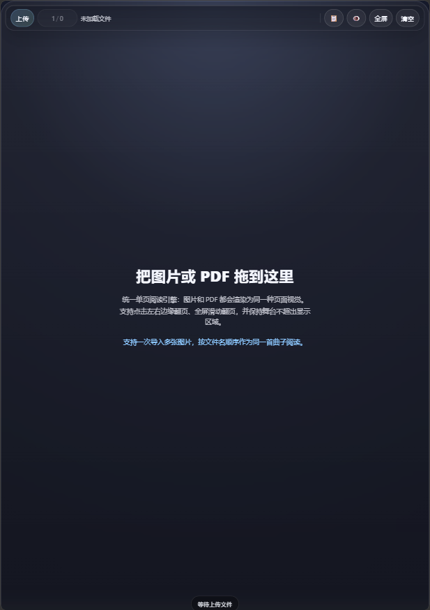
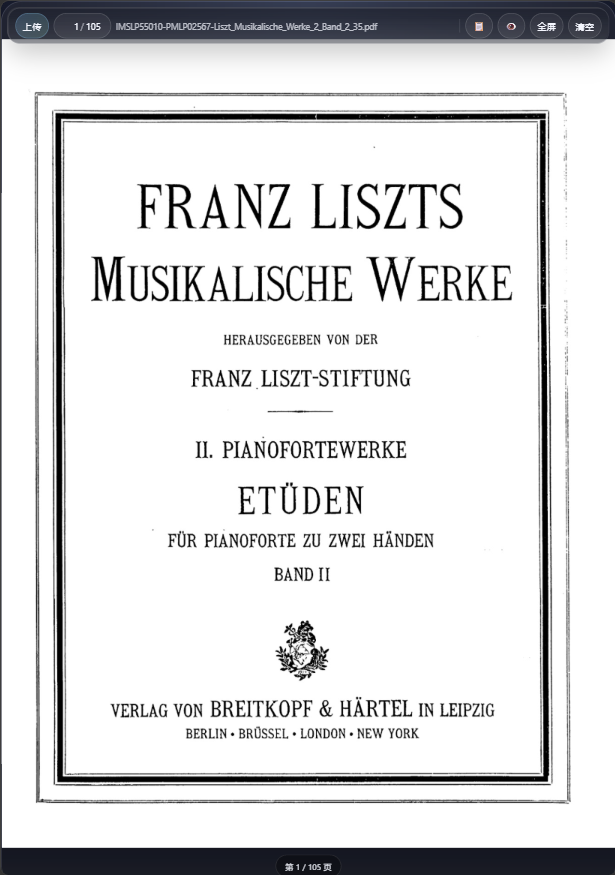
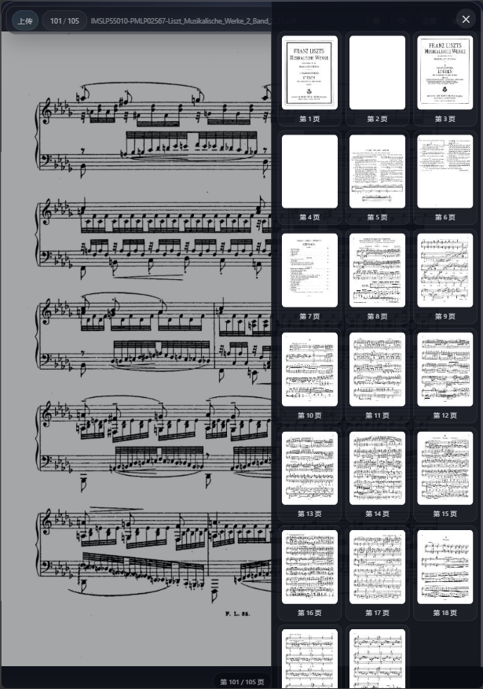
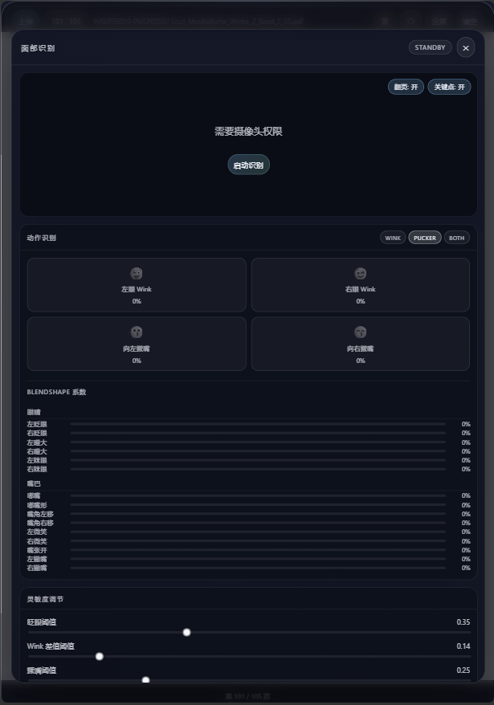

# 乐谱查看器（离线单入口版）

这是一个离线可用的单入口项目：入口页面是 `index.html`，本地依赖统一放在 `vendor/` 子文件夹。

你可以直接双击 `index.html` 使用，不需要安装 Node.js、不需要运行构建命令，也不依赖网络 CDN。

## 项目特点

- 单入口：始终从 `index.html` 进入应用
- 本地依赖：`vendor/pdfjs` 内置 PDF.js，不使用浏览器原生 PDF 阅读内核
- 离线可用：核心浏览功能无需联网即可打开和使用
- 支持拖拽上传：可将文件直接拖到页面中加载
- 支持图片和 PDF：统一单页全屏阅读效果
- 支持多图曲谱：可一次导入多张图片并按顺序翻页
- 支持翻页交互：左右边缘点击、滑动、键盘翻页、空格下一页
- 支持页码输入跳转
- 支持缩放与拖拽：滚轮/双指缩放、拖拽查看细节、双击恢复
- 缩略图面板：快速定位到指定页
- 全屏与沉浸式 UI：中间点击隐藏/显示控制条
- 会话自动恢复：24 小时内可恢复上次浏览的曲谱
- 可选面部识别翻页：眨眼/撅嘴控制，灵敏度与模式可调

## 文件结构

```text
music-score-upload-viewer/
  index.html
  web.config
  vendor/
    pdfjs/
      pdf.min.js
      pdf.worker.min.js
      pdf.worker.mjs
  README.md
```

## 使用方式

1. 打开 `index.html`

  

2. 点击“上传文件”或直接拖拽文件到页面

  
  
3. 根据文件类型进行浏览：
    - 图片：单页全屏阅读，支持多图连续翻页
    - PDF：由本地 PDF.js 渲染为单页阅读视图
    - 仅支持“图片组”或“单个 PDF”，不支持混合导入
4. 可选操作：
    - 点击页码显示区域输入页码跳转
    - 点击 📋 打开缩略图面板快速定位
  
    - 点击 “全屏” 进入沉浸式浏览
    - 点击 👁️ 打开面部识别面板并按提示启动
  

## 交互说明

- 翻页：左右边缘点击、左右方向键、空格键、横向滑动
- 缩放与拖拽：鼠标滚轮/触控双指缩放，缩放后拖拽移动
- 复位：双击或连续点击中间区域可快速回到 100% 缩放
- UI 显示：点击中间区域可隐藏/显示顶部栏与底部状态条
- 缩略图：面板内点击缩略图直接跳转

## 兼容性说明

- 建议使用最新版 Chrome 或 Edge 以获得更稳定的 PDF.js 渲染体验
- 本项目不使用浏览器原生 PDF 阅读器，跨浏览器一致性更好
- 面部识别需要浏览器支持摄像头与 WebAssembly/WebGL，并可能需要联网加载引擎与模型

## 会话恢复

- 关闭页面后会自动保存当前曲谱与页码，24 小时内可自动恢复
- 点击“清空”可移除本地缓存并重置为初始状态

## 隐私与安全

- 文件在本地浏览器中处理，不会主动上传到服务器
- 关闭页面后，临时对象 URL 会释放
- 面部识别仅在本地进行，是否开启摄像头由浏览器权限控制

## 适用场景

- 电子琴谱/纸质谱扫描件快速查看
- 无网络环境下的临时演示
- 需要“零部署”交付的轻量工具场景
